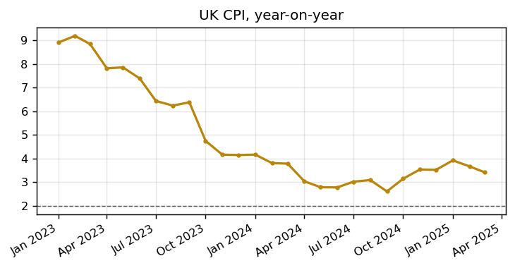
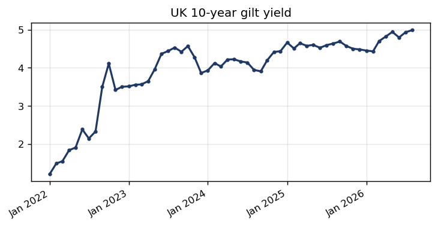

# UK inflation persistence versus wage growth: who blinks first?

## The question this note is actually asking

Every UK inflation debate eventually collapses into the same underlying question: is pay growth still running hot enough to keep pushing prices up, or has it cooled enough that inflation can fall back to target on its own? The Bank of England's Monetary Policy Committee has spent much of the last two years wrestling with exactly this, because the two variables move together but not in lockstep, and the lag between them is where all the interesting policy decisions live.

The basic mechanics are worth setting out plainly before getting into the data. When wages rise faster than productivity, firms facing higher labour costs tend to pass at least some of that through into the prices they charge — this is the "wage-price spiral" story that dominates so much of the commentary. But it isn't automatic, and it isn't instant. Firms can absorb some of the cost in margins for a while, especially if they're worried that raising prices will cost them customers to competitors. And workers' wage demands are themselves partly a response to inflation they've already experienced — if the weekly shop got 8% more expensive last year, that's the number people bring into their next pay negotiation, whether or not it's still 8% today. That feedback loop, running in both directions with a lag attached, is what makes "wage growth versus inflation" such a persistent theme rather than something that resolves cleanly in a single quarter.

## Where UK inflation actually stands

The chart below is UK CPI inflation on a year-on-year basis, against the Bank's 2% target.

*Source: OECD CPI series (GBRCPIALLMINMEI), mirrored on FRED — last verified print: March 2025*

The honest starting point here is a genuine limitation in the data this note draws on: the free, key-less feed this portfolio uses hasn't been updated past March 2025, which is a real gap rather than a judgement about where inflation is heading — a direct ONS API query was tried and returned nothing usable for the series IDs attempted. What the chart does show, up to that point, is a series that spent an extended period running well above target before beginning a gradual descent — consistent with the broader, widely reported UK story of inflation that peaked hard in 2022-23 on the back of energy prices and supply disruption, and has been grinding back toward target since, without ever quite completing the journey cleanly.

## Where wage growth has actually been

This note doesn't have a live wage-growth data feed behind it — no free, key-less series was sourced for this build — so what follows draws on the broader, well-documented pattern rather than a dataset this portfolio pulled itself, and should be read with that distinction in mind. UK regular pay growth ran unusually hot through 2022 and into 2023, at points touching rates not seen in decades outside of the immediate post-financial-crisis distortions, as a tight post-pandemic labour market and the same cost-of-living pressure feeding into CPI fed back into pay settlements. That pace has cooled materially since, but by most public reporting it has continued to run above the roughly 2% rate that would be comfortably consistent with 2% inflation once productivity growth (itself persistently weak in the UK) is netted out.

That's the crux of the "who blinks first" framing. If wage growth keeps decelerating faster than the Bank currently assumes, the case for further rate cuts strengthens quickly — inflation would have more room to fall without the Bank needing to worry that pay settlements will simply reignite it. If wage growth instead stalls at an elevated level, even as headline inflation keeps drifting down, the Bank faces a much less comfortable choice: cut anyway and risk a renewed pickup in underlying price pressure, or hold for longer than the headline data alone would justify, wearing the political and economic cost of tighter policy for longer.

## Where gilt yields fit into the story

The 10-year gilt yield is a useful cross-check on this debate, because it's the market's own aggregated view of where UK rates and inflation are heading over the next decade, updated in real time in a way survey data can't match.

*Source: OECD long-term government bond yield series (IRLTLT01GBM156N), mirrored on FRED*

A gilt yield that keeps climbing even as headline CPI cools is one of the more reliable signals that the market isn't fully convinced the wage-growth side of this story has been resolved — it would be pricing either continued upward pressure on the path of Bank Rate, or a larger term premium for holding UK government debt for a decade, both of which are consistent with a market still uncertain the UK has fully escaped the wage-price dynamic described above. Reading the gilt yield alongside the CPI print, rather than in isolation, is a genuinely useful habit — either series on its own tells only half of this story.

## What would need to happen for the Bank's job to get easier

The cleanest resolution to this whole debate, from the Bank's perspective, would be wage growth decelerating toward something closer to 3% on a sustained basis without a corresponding rise in unemployment — in other words, a genuine "soft landing" for the labour market specifically, where the tightness that drove wages up in the first place unwinds gradually through fewer vacancies and less aggressive hiring, rather than through actual job losses. That's a real, plausible path, not a hopeful fiction: vacancy rates across much of the UK economy have already come down substantially from their post-pandemic peaks, which is generally the first sign of a labour market cooling in an orderly way rather than a disorderly one.

## A UK-specific complication: the productivity problem

It's worth spending a moment on why this debate has been more stubborn in the UK than in some comparable economies, because the answer isn't just "inflation was higher here" — it's productivity, and it's a genuinely UK-specific weak point. Real wage growth that workers actually feel in their pockets, without simply feeding straight back into prices, ultimately has to be funded by output per worker rising over time; an economy can pay people more sustainably only if it's also producing more per hour worked. UK productivity growth has been unusually weak for a developed economy for well over a decade now — a pattern that predates both the pandemic and the 2022-23 inflation spike, and one that economists still don't fully agree on the cause of, though weak business investment and a services-heavy economy with fewer productivity gains available from automation are both commonly cited factors.

That matters directly for the wage-versus-inflation question, because it narrows the room the UK has to accommodate strong nominal pay growth without inflationary consequences. In an economy with 2% productivity growth, wage rises of 4% are broadly consistent with stable prices once that productivity gain is netted off. In an economy where productivity growth has been closer to flat for long stretches, the same 4% wage growth translates far more directly into cost pressure that firms have to either absorb or pass on. This is arguably the more structural version of the "who blinks first" question posed at the top of this note — even if cyclical wage growth cools as expected, the UK's underlying capacity to sustain real pay rises without inflation stays constrained until the productivity picture itself improves, which is a multi-year story rather than something a few quarters of data will resolve.

## Tailwinds

A few genuine tailwinds support the case that this resolves in the Bank's favour rather than dragging on indefinitely. First, energy price base effects: a large share of the original 2022-23 inflation spike was energy-driven, and as those elevated comparison points roll out of the year-on-year calculation, headline CPI gets a mechanical tailwind even before any change in underlying dynamics. Second, the labour market cooling that's already visible in vacancy data tends to lead wage growth with a lag of several quarters, which means some of the deceleration in pay growth that would resolve this debate may already be baked in and simply hasn't shown up in the reported figures yet. Third, a UK economy that's grown only sluggishly by historical standards gives firms less pricing power to pass through whatever wage pressure remains, which acts as a natural brake on the wage-price feedback loop even without further deliberate policy tightening. None of this guarantees a clean resolution on any particular timeline, but it's a meaningfully more constructive backdrop than the acute phase of this story back in 2022-23, when almost none of these forces were working in the same direction at once.
