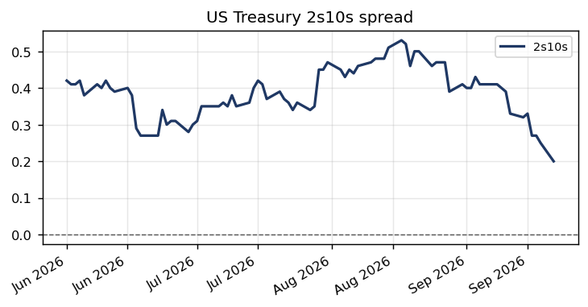
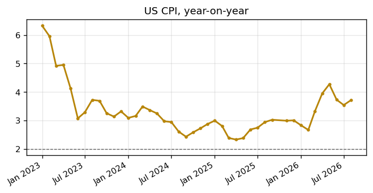

# US soft-landing probability, and what would prove it wrong

*Thematic note — independent macro research portfolio*

## Defining the term properly before using it

"Soft landing" gets used loosely enough in financial commentary that it's worth defining precisely before relying on it. A soft landing means the Federal Reserve brings inflation back down to its 2% target without triggering a recession or a material rise in unemployment along the way — the economy slows just enough to cool price pressure, and no further. The alternative outcomes are a "hard landing" (inflation falls, but only because the economy actually contracts and unemployment rises meaningfully) or "no landing" (growth and inflation both stay uncomfortably firm, and the Fed ends up needing to do more than currently priced). Historically, soft landings are the exception rather than the rule — most Fed tightening cycles have ended in recession — which is exactly why the debate over whether this one is different has occupied so much space in market commentary.

## What the data in this portfolio actually says

Two series in this portfolio speak most directly to the soft-landing question: the shape of the Treasury yield curve, and the path of CPI inflation.

*Source: US Treasury daily par yield curve, pulled month by month via the Treasury's public XML feed*

The 2s10s spread is the most widely cited market-based recession signal there is, precisely because of its track record: it has inverted (gone negative) ahead of every US recession since the 1970s, as the market prices in Fed rate cuts to come. Over the window this portfolio covers, the spread has stayed positive throughout, and for a period actually widened further, which is the market's way of leaning into the soft-landing case rather than away from it — a market genuinely worried about recession would typically be pushing this spread toward, or through, zero, not away from it.

*Source: FRED — CPIAUCSL*

The inflation side of the picture is less clean. CPI has come down substantially from its post-pandemic peak, but it has spent this window oscillating in a range still comfortably above the Fed's 2% target rather than making a clear, final approach to it — more a plateau than a glide path. That's the single biggest reason the soft-landing case isn't a settled matter: a curve that isn't pricing recession is reassuring on the growth side, but it doesn't by itself resolve whether the "last mile" of getting inflation fully back to target requires more economic pain than has been felt so far.

## The labour-market piece this portfolio can't yet see directly

No free, key-less US labour-market series (payrolls, unemployment rate, job openings) was sourced into this portfolio's own data pulls, so what follows draws on the broader, publicly reported picture rather than a dataset built here — worth being explicit about, in the same way the wage-growth discussion in the companion UK note is. By most public reporting, US unemployment has stayed low relative to history through this period even as job growth has slowed from its earlier pace, and measures of labour-market churn (quits, openings) have cooled from clearly overheated levels toward something closer to pre-pandemic norms. That's broadly the pattern a soft landing would produce: a gradual normalisation in hiring intensity rather than an outright downturn in employment. The Sahm Rule — a well-known recession-timing indicator built on the pace of change in the unemployment rate, rather than its level — is one of the more useful things to track here precisely because it's designed to catch the *turn* toward a hard landing early, rather than confirming a recession only once it's obviously underway.

## What would actually falsify the soft-landing case

Being specific about what would prove this wrong matters more than restating the base case, because a forecast that can't be falsified isn't really a forecast at all. Three things would meaningfully undermine the soft-landing thesis:

First, a 2s10s spread that inverts again, and stays inverted for a sustained period rather than briefly. Given the curve's own history, that would be the single clearest market-based signal that the "no recession" case has broken down, and it would be a very different picture from the persistently positive spread seen throughout this portfolio's data window.

Second, a CPI print — or a run of them — that breaks decisively higher out of the range it's been oscillating in, rather than continuing to plateau. That would suggest the Fed's already-delivered rate cuts eased policy too far, too soon, and would put the "no landing, inflation reaccelerates" outcome back on the table in a way the current data doesn't support.

Third, on the labour-market side this portfolio can't track directly: a sharp rise in the unemployment rate over a short period — the kind of move the Sahm Rule is specifically built to flag — rather than the gradual cooling in hiring intensity that's been the pattern so far. A slow drift in vacancies is consistent with a soft landing; a fast move in the unemployment rate itself generally is not.

None of these three has actually happened over the window this note covers. That's not proof the soft landing succeeds — plenty of tightening cycles have looked fine for a long stretch before turning — but it's the honest state of the falsification tests available from the data at hand, rather than a confident prediction either way.

## A brief look back: why this cycle might genuinely be different

It's worth asking, honestly, why this tightening cycle might avoid the recession that most of its predecessors didn't. Two structural features of this cycle are commonly cited, and both are worth taking seriously rather than dismissing as the kind of "this time is different" reasoning that tends to age badly. First, the initial inflation shock this cycle was unusually concentrated in a handful of identifiable, largely external causes — pandemic-era supply-chain disruption and an energy price spike tied to geopolitical events — rather than emerging primarily from an overheating domestic economy in the way, for instance, the late-1970s inflation did. A shock with a more identifiable external cause is mechanically more likely to fade as its causes fade, rather than requiring the kind of prolonged demand destruction that ends economic expansions.

Second, US household and corporate balance sheets entered this tightening cycle in unusually strong shape by historical standards, with lower debt-service burdens relative to income than in the run-up to previous downturns, particularly the 2008 financial crisis. A more resilient private sector can absorb higher interest rates for longer without the kind of forced deleveraging and spending collapse that turns a slowdown into a recession. Neither point guarantees a soft landing — plenty of previous cycles had their own reasons to believe "this time" would be different, and weren't — but they're genuine, data-grounded differences from many historical tightening cycles rather than just optimistic narrative.

## Tailwinds

Several genuine tailwinds support the soft-landing case specifically. The Fed has already delivered a meaningful amount of easing from its cycle peak, which gives it real room to respond quickly if labour-market data does turn, rather than needing to start cutting from a standing start — a central bank with cutting room in reserve is structurally better placed to manage a soft landing than one still raising rates into weakening data. The US labour market's cooling has so far come primarily through a slower pace of hiring rather than actual layoffs, which is historically a more benign way for labour-market tightness to unwind, and tends to be more reversible if growth picks back up. And US productivity growth has held up reasonably well through this cycle by historical standards, which — much like the point made in the companion UK note — gives the economy more room to absorb whatever wage and cost pressure remains without that pressure needing to show up entirely in consumer prices. Taken together, these are real, data-grounded reasons the current cycle could plausibly complete the soft landing that most of its predecessors didn't — not a guarantee, but a genuinely more constructive starting point than many past tightening cycles had at a comparable stage.
